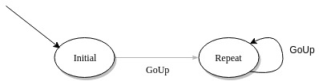

# Kt-FSM

An elegant finite state machine written in Kotlin. 
Base code was in [this answer](https://codereview.stackexchange.com/questions/143726/event-driven-finite-state-machine-dsl-in-kotlin)
I added strong-typing support and maybe other stuff.

## Example

The following code represents this FSM



*Code*

```Kotlin
import fsm.BaseEvent
import fsm.BaseState
import fsm.StateMachine

// Inherit your custom events and states from provided base classes
class GoUp : BaseEvent()

class Initial : BaseState()
class Repeat : BaseState()

fun main(args: Array<String>) {

    val m = StateMachine.buildStateMachine(Initial()) {
        state(Initial()) {
            // Code written outside action{} will run as Kotlin's init{}
            println("Initializing")
            // Code on state processing
            action {
                println("Entered [${it.name.javaClass.simpleName}]")
            }
            edge(GoUp(), Repeat()) {
                // Code of transition
                action {
                    println("Going to Repeat state")
                }
            }
        }
        state(Repeat()) {
            action {
                println("Entered [${it.name.javaClass.simpleName}]")
            }

            // Multiple actions
            action {
                println("Will get bored!")
            }

            edge(GoUp(), Repeat()) {
                action {
                    println("Repeating")
                }
            }
        }
    }

    m.initialize()
    m.acceptEvent(GoUp())
    m.acceptEvent(GoUp())
    m.acceptEvent(GoUp())
}
```

*Output*

```
Initializing
Entered [Initial]
Going to Repeat state
Entered [Repeat]
Will get bored!
Repeating
Entered [Repeat]
Will get bored!
Repeating
Entered [Repeat]
Will get bored!

```